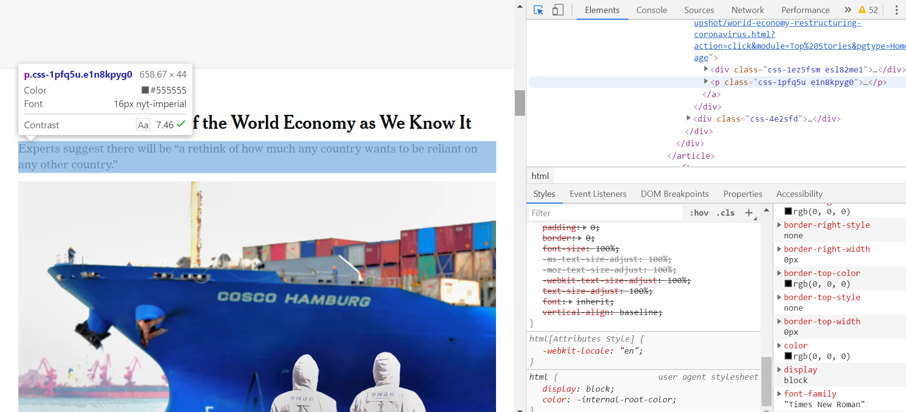
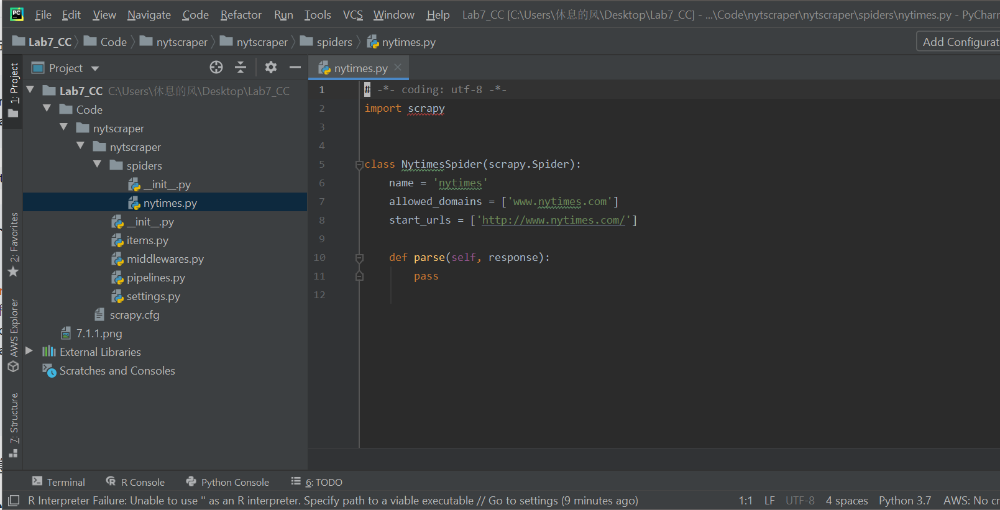
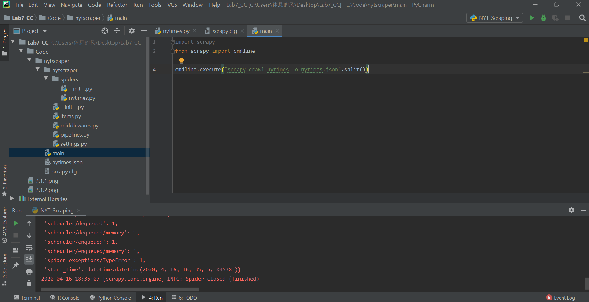

# CLOUD-COMPUTING-CLASS-2020-Lab7
# Task 7.1: Extract selected information from a newspaper webpage

Check HTML structure

The initial code

Creating main function for debug

# Task 7.2: Obtain a subset of the movie industry to do some research  
# Task 7.3: Study the obtained data using the Elastic Stack  

Q74: Explain what you have done in the README.md file of the Lab7 folder of your answers repository, add the new plot. Push the code changes to your scrapy-lab repository (30% of total grade for this lab session)
By using Xpath library, we can get the suitable data from website, but it is difficult to crawl the text on the hyperlink.For example, <a href="/name/nm0000148/?ref_=ttfc_fc_cl_t1"> Harrison Ford
</a>
we want to get the actor ID and actor name from its Xpath, but can not get the Json results although studying the Xpath basic grammar for a long time. 
Q75: How long have you been working on this session? What have been the main difficulties you have faced and how have you solved them?
We have be work for about 21 hours to figure out the problem and learn basic skill of web scraping,but encounting some syntax problem of code part, thus leading the task 7.3 to be blank because we have no dataset.
